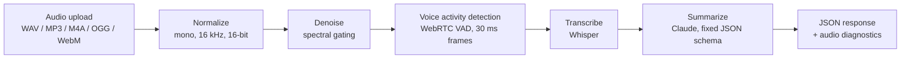

# Voice Insight API

A FastAPI service that turns noisy audio into a clean transcript and a structured summary (key points, action items, topics).

**Demo:** [2-minute walkthrough](LOOM_LINK_HERE)

## How it works



| Stage | Module | What it does |
| --- | --- | --- |
| Preprocessing | `app/preprocessing.py` | Decodes any common format with pydub, resamples to 16 kHz mono, removes background noise with `noisereduce`, then drops non-speech frames with WebRTC VAD |
| Transcription | `app/transcription.py` | Uses the OpenAI `whisper-1` API when `OPENAI_API_KEY` is set, otherwise a local Whisper `base` model |
| Summarization | `app/summarization.py` | Sends the transcript to Claude with a prompt that restricts it to the transcript and a fixed JSON shape |
| API | `app/main.py` | FastAPI routes, input validation and error mapping |

## Run it

```bash
git clone https://github.com/Riddhim-r/voice-insight-api.git
cd voice-insight-api
python -m venv venv && source venv/bin/activate   # Windows: venv\Scripts\activate
pip install -r requirements.txt

export ANTHROPIC_API_KEY=...        # required for /process
export OPENAI_API_KEY=...           # optional; without it, local Whisper is used

uvicorn app.main:app --reload
```

Open `http://localhost:8000/docs` for the interactive Swagger UI.

### Endpoints

| Method | Path | Returns |
| --- | --- | --- |
| `GET` | `/health` | Liveness check |
| `POST` | `/transcribe` | Preprocessing + transcription only (useful for debugging the speech stage) |
| `POST` | `/process` | Full pipeline: transcript, summary, key points, action items, topics |

```bash
curl -F "file=@meeting.m4a" http://localhost:8000/process
```

```json
{
  "transcript": "...",
  "language": "en",
  "summary": "...",
  "key_points": ["..."],
  "action_items": ["..."],
  "topics": ["..."],
  "audio_diagnostics": {
    "original_duration_s": 14.76,
    "processed_duration_s": 11.31,
    "silence_removed_s": 3.45
  }
}
```

### Tests

```bash
python test_pipeline.py
```

Generates real speech with gTTS, mixes in Gaussian background noise and silence padding, then checks preprocessing, transcription and every endpoint. On that sample, VAD removed 3.45 s of a 14.76 s clip (about 23%) before transcription.

## Design decisions

- **Clean the audio before Whisper, not after.** Removing noise and silence first means less audio is sent to the speech model, which lowers cost and latency and cuts the hallucinated text Whisper tends to produce during long silences.
- **Fail hard instead of faking output.** If a key is missing or an upstream API fails, the service returns an explicit error rather than a placeholder transcript or summary. Errors are mapped deliberately: empty upload → `400`, undecodable audio → `422`, upstream speech or LLM failure → `502`.
- **Structured output from the LLM.** The summary must come back in one fixed JSON shape, and code fences are stripped before parsing. If the model still returns invalid JSON, the raw text is passed through with a `_parse_warning` flag rather than being dropped.

## Stack

Python · FastAPI · pydub · noisereduce · webrtcvad · OpenAI Whisper · Anthropic Claude · FastAPI `TestClient`
