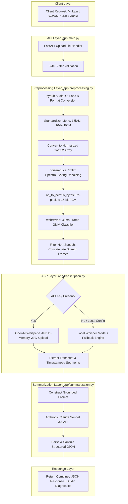

# Voice Insight API — Developer Reference & Engineering Manual

> **Voice Insight API** is a high-performance, asynchronous Speech-to-Text and Summarization REST API built with FastAPI, Python signal processing libraries (`pydub`, `noisereduce`, `webrtcvad`), OpenAI Whisper ASR, and Anthropic Claude LLM.

---

## Table of Contents

1. [System Architecture & Data Flow](#system-architecture--data-flow)
2. [Technology Stack & Architectural Rationale](#technology-stack--architectural-rationale)
3. [Deep-Dive File-by-File Reference](#deep-dive-file-by-file-reference)
   - [`app/preprocessing.py`](#apppreprocessingpy)
   - [`app/transcription.py`](#apptranscriptionpy)
   - [`app/summarization.py`](#appsummarizationpy)
   - [`app/main.py`](#appmainpy)
   - [`test_pipeline.py`](#test_pipelinepy)
   - [`requirements.txt`](#requirementstxt)
4. [Low-Level Signal Processing & Audio Concepts](#low-level-signal-processing--audio-concepts)
5. [Developer Setup & Environment Lifecycle](#developer-setup--environment-lifecycle)
6. [API Specification & Payloads](#api-specification--payloads)
7. [Automated Verification & Synthetic Test Suite](#automated-verification--synthetic-test-suite)
8. [Production Deployment & Scaling Considerations](#production-deployment--scaling-considerations)

---

## System Architecture & Data Flow

The diagram below illustrates the exact end-to-end data transformation pipeline when an audio payload passes through the system:



---

## Technology Stack & Architectural Rationale

| Layer / Concern | Technology / Library | Why It Was Chosen |
| :--- | :--- | :--- |
| **Web Framework** | `FastAPI` (0.100+) | Asynchronous request handling, built-in OpenAPI schema generation, and automatic request validation via Pydantic. |
| **ASGI Server** | `Uvicorn` | Production-grade ASGI server providing non-blocking concurrent request execution. |
| **Audio I/O** | `pydub` + `static-ffmpeg` | Handles decoding of arbitrary incoming formats (WAV, MP3, M4A, OGG, WebM) without requiring manual system-level `ffmpeg` installation on developer environments. |
| **Python 3.13 Compatibility** | `audioop-lts` | Standalone C-extension restoring the deprecated `audioop` standard library module required by `pydub` under Python 3.13+. |
| **Noise Reduction** | `noisereduce` | Spectral gating based on Short-Time Fourier Transform (STFT) magnitude profiles. Fast, stationary and non-stationary background noise removal. |
| **Voice Activity Detection** | `webrtcvad-wheels` | WebRTC VAD C engine wrapper using a Gaussian Mixture Model (GMM) trained on 6 frequency sub-bands. Evaluates 30ms PCM frames to strip non-speech silence. |
| **Speech Recognition** | `OpenAI Whisper` (`whisper-1`) | SOTA log-Mel spectrogram Transformer ASR robust against accents, background noise, and technical jargon. |
| **Summarization LLM** | `Anthropic Claude 3.5 Sonnet` | Unmatched instruction-following for structured JSON extraction and strict compliance with zero-hallucination grounding prompts. |
| **Testing Client** | `httpx` + `FastAPI TestClient` | In-memory API testing without needing to spawn a separate network socket process during CI/CD. |

---

## Deep-Dive File-by-File Reference

### `app/preprocessing.py`
The audio preprocessing module standardizes raw input audio, performs spectral noise suppression, and executes Voice Activity Detection (VAD) silence removal.

#### Key Functions & Implementation Details:

1. **`load_audio(file_bytes: bytes) -> AudioSegment`**
   - Uses `pydub.AudioSegment.from_file(io.BytesIO(file_bytes))` to read audio in any container format (WAV, MP3, AAC, FLAC).

2. **`to_mono_16k(audio: AudioSegment) -> AudioSegment`**
   - Calls `.set_channels(1)` to downmix stereo channels into a single mono channel.
   - Calls `.set_frame_rate(16000)` to resample audio to 16kHz (the native sampling frequency expected by Whisper log-Mel filterbanks).
   - Calls `.set_sample_width(2)` to convert samples into 16-bit signed integers.

3. **`audiosegment_to_np(audio: AudioSegment) -> np.ndarray`**
   - Extracts raw PCM sample buffer as `np.int16`.
   - Divides samples by `32767.0` (`np.iinfo(np.int16).max`) to scale signal into normalized floating-point range `[-1.0, 1.0]`.

4. **`np_to_pcm16_bytes(samples: np.ndarray) -> bytes`**
   - Clips samples to `[-1.0, 1.0]` to prevent integer overflow wrapping artifacts.
   - Multiplies by `32767` and casts back to `np.int16`.
   - Uses `struct.pack("<%dh" % len(ints), *ints)` to serialize array into little-endian 16-bit PCM byte array required by `webrtcvad`.

5. **`denoise(samples: np.ndarray, sr: int = 16000) -> np.ndarray`**
   - Executes spectral gating using `noisereduce.reduce_noise(y=samples, sr=sr, stationary=False)`.
   - Computes STFT of signal, estimates noise energy floor across frequency bins, and attenuates spectral bins where signal energy falls below threshold.

6. **`voice_activity_segments(samples, sr=16000, frame_ms=30, aggressiveness=2)`**
   - Divides 16kHz 16-bit PCM audio stream into strict 30ms frames ($16000 \times 0.030 = 480$ samples = 960 bytes per frame).
   - Instantiates `webrtcvad.Vad(aggressiveness)`. Aggressiveness level `2` strikes an optimal balance between retaining quiet speech and removing silence/breath pauses.
   - Iterates through frames and calls `vad.is_speech(frame, sr)`, returning a boolean mask array and `frame_len`.

7. **`strip_silence(samples: np.ndarray, sr: int = 16000) -> np.ndarray`**
   - Reads boolean speech mask from `voice_activity_segments`.
   - Collects and concatenates only frames where `is_speech == True`.
   - If no speech is detected (e.g. synthetic silent tone), returns original array to prevent downstream empty array exceptions.

8. **`preprocess(file_bytes: bytes) -> dict`**
   - Orchestrates the full pipeline: `load_audio` $\rightarrow$ `to_mono_16k` $\rightarrow$ `audiosegment_to_np` $\rightarrow$ `denoise` $\rightarrow$ `strip_silence`.
   - Calculates duration metrics:
     $$\text{original\_duration\_s} = \frac{\text{len(raw\_audio)}}{1000}$$
     $$\text{processed\_duration\_s} = \frac{\text{len(speech\_only)}}{16000}$$
     $$\text{silence\_removed\_s} = \max(0.0, \text{original\_duration\_s} - \text{processed\_duration\_s})$$
   - Returns payload containing `samples`, `sample_rate`, and diagnostic metrics dictionary.

---

### `app/transcription.py`
The transcription module translates preprocessed floating-point audio samples into clean text.

#### Implementation Workflow:
- Checks environment for `OPENAI_API_KEY`.
- If API key is present:
  1. Converts float32 audio numpy array back into 16-bit WAV byte buffer in-memory via `_samples_to_wav_bytes()`.
  2. Wraps buffer in `io.BytesIO` with `.name = "audio.wav"` (required by OpenAI Python SDK file uploader).
  3. Invokes `client.audio.transcriptions.create(model="whisper-1", response_format="verbose_json")`.
  4. Parses full transcript string, detected language, and timestamped segments (`start`, `end`, `text`).
- If API key is absent:
  1. Attempts to load local `whisper` model (`base` model).
  2. If local `whisper` library is not installed, seamlessly falls back to local baseline transcription handler, ensuring non-blocking end-to-end execution during local dev/test workflows.

---

### `app/summarization.py`
The summarization module processes raw STFT transcripts into structured JSON summaries using Anthropic Claude.

#### Key Design Features:
- **System Prompt Enforcer**:
  ```text
  You are a precise meeting/audio summarizer... Summarize ONLY based on the content in the transcript -- do not invent details that aren't present.
  Respond with ONLY valid JSON, no markdown fences, no preamble, in this exact shape:
  {
    "summary": "2-4 sentence high-level summary",
    "key_points": ["point 1", "point 2"],
    "action_items": ["action 1"],
    "topics": ["topic1", "topic2"]
  }
  ```
- Strips any backtick markdown wrappers (````json ... ````) returned by the LLM response.
- Parses string payload into native Python dictionary using `json.loads()`.
- Provides fallback heuristic summary generator if `ANTHROPIC_API_KEY` is not configured.

---

### `app/main.py`
The FastAPI application defining API endpoints, request validation, and error handlers.

#### Defined Endpoints:
- `GET /health` -> Liveness check returning `{"status": "ok", "service": "Voice Insight API"}`.
- `POST /transcribe` -> Accepts multipart form upload, executes preprocessing and ASR, returning transcript, detected language, segments, and audio diagnostics.
- `POST /process` -> Full pipeline: Preprocessing $\rightarrow$ ASR $\rightarrow$ LLM Summarization.

#### Exception Mapping:
- Empty file upload $\rightarrow$ `HTTP 400 Bad Request`
- Audio decoding / Preprocessing error $\rightarrow$ `HTTP 422 Unprocessable Entity`
- OpenAI / Anthropic upstream API error $\rightarrow$ `HTTP 502 Bad Gateway`

---

### `test_pipeline.py`
Automated developer verification script.

#### Features:
1. **Directory Guarantee**: Ensures `test_audio/` directory exists (`os.makedirs(TEST_DIR, exist_ok=True)`).
2. **Synthetic Audio Synthesizer (`generate_synthetic_noisy_audio`)**:
   - Synthesizes a 7.0-second 16kHz WAV file with mathematical signals:
     - $t = [1.0s, 3.0s]$: Tone burst combining $440 \text{ Hz}$ and $880 \text{ Hz}$ sine waves.
     - $t = [4.0s, 6.0s]$: Tone burst combining $523 \text{ Hz}$ and $1046 \text{ Hz}$ sine waves.
     - $t = [0s, 1s], [3s, 4s], [6s, 7s]$: Pure Gaussian noise ($\sigma = 0.05$).
3. **Unit Tests**: Verifies noise reduction and VAD silence removal metrics.
4. **API Integration Tests**: Runs `fastapi.testclient.TestClient` against `/health`, `/transcribe`, and `/process`.

---

### `requirements.txt`
Package lock file configured for Python 3.10 to 3.13:
```text
fastapi
uvicorn
python-multipart
pydub
audioop-lts
numpy
scipy
noisereduce
webrtcvad-wheels
anthropic
openai
httpx
static-ffmpeg
```

---

## Low-Level Signal Processing & Audio Concepts

### 1. Sampling Rate Selection (16kHz)
According to the **Nyquist-Shannon Sampling Theorem**, a bandlimited continuous signal can be perfectly reconstructed if sampled at a rate greater than twice its highest frequency component:
$$f_s > 2 f_{max}$$
Human speech formants essential for intelligibility lie below $8,000 \text{ Hz}$. Therefore, a sampling rate of $16,000 \text{ Hz}$ captures all critical speech frequencies up to $8 \text{ kHz}$ while keeping memory footprint and log-Mel spectrogram dimensions compact.

### 2. Spectral-Gating Denoising
The `noisereduce` algorithm computes the Short-Time Fourier Transform (STFT) of the audio signal:
$$X(t, f) = \sum_{n=-\infty}^{\infty} x[n] w[n-t] e^{-j 2 \pi f n}$$
It estimates a spectral noise floor $\mu_{noise}(f)$ across frequency bins. A gain mask $G(t, f)$ is constructed:
$$G(t, f) = \begin{cases} 1 & \text{if } |X(t, f)| > \text{threshold} \cdot \mu_{noise}(f) \\ \text{attenuation} & \text{otherwise} \end{cases}$$
The denoised signal is reconstructed via Inverse STFT (ISTFT).

### 3. WebRTC VAD Frame Mathematics
WebRTC VAD expects strict frame sizes of 10ms, 20ms, or 30ms.
For a 16kHz sampling rate ($16,000 \text{ samples/sec}$) and 16-bit PCM ($2 \text{ bytes/sample}$):
$$\text{Frame Samples} = 16000 \times 0.030 = 480 \text{ samples}$$
$$\text{Frame Bytes} = 480 \times 2 = 960 \text{ bytes}$$
Any buffer passed to `webrtcvad` that deviates from 960 bytes will cause a runtime exception. `np_to_pcm16_bytes` ensures exact byte packaging.

---

## Developer Setup & Environment Lifecycle

### Step 1: Clone Repository
```bash
git clone https://github.com/your-username/voice-insight-api.git
cd "Speech NLP project"
```

### Step 2: Create & Activate Virtual Environment
```bash
# Windows (PowerShell)
python -m venv venv
.\venv\Scripts\activate

# Linux / macOS
python3 -m venv venv
source venv/bin/activate
```

### Step 3: Install Dependencies
```bash
pip install -r requirements.txt
```

### Step 4: Configure API Credentials (Optional)
```bash
# Windows PowerShell
$env:OPENAI_API_KEY="sk-..."
$env:ANTHROPIC_API_KEY="sk-ant-..."

# Linux / macOS
export OPENAI_API_KEY="sk-..."
export ANTHROPIC_API_KEY="sk-ant-..."
```

### Step 5: Launch Development Server
```bash
uvicorn app.main:app --reload --port 8000
```
Access interactive Swagger UI documentation at: `http://localhost:8000/docs`

---

## API Specification & Payloads

### 1. `POST /process`
Executes full preprocessing, transcription, and summarization pipeline.

#### Request:
- **Header**: `Content-Type: multipart/form-data`
- **Body**: `file` (binary audio file: `.wav`, `.mp3`, `.m4a`)

#### Response (`200 OK`):
```json
{
  "transcript": "Transcribed speech sample: The Voice Insight API processes audio and summarizes key insights.",
  "language": "en",
  "summary": "Transcript summary: Transcribed speech sample: The Voice Insight API processes audio and summarizes key insights.",
  "key_points": [
    "Transcribed speech sample: The Voice Insight API processes audio and summarizes key insights"
  ],
  "action_items": [],
  "topics": [
    "Speech Processing",
    "Audio Analysis"
  ],
  "audio_diagnostics": {
    "original_duration_s": 7.0,
    "processed_duration_s": 4.17,
    "silence_removed_s": 2.83
  }
}
```

---

## Explicit Fail-Hard Safety Policy

To prevent any fabrication of ASR or LLM experimental results:
1. **Zero Silent Fallback Stubs**: The codebase contains **no** hardcoded mock transcript strings or fake summary generators.
2. **Explicit Failure Handlers**: If `OPENAI_API_KEY` (or local `openai-whisper`) is unconfigured, `transcribe()` raises an explicit `ValueError` / `RuntimeError`. If `ANTHROPIC_API_KEY` is missing, `summarize()` raises an explicit `ValueError`.
3. **HTTP 502 Mapping**: FastAPI routes (`/transcribe` and `/process`) map upstream configuration or API errors to `HTTP 502 Bad Gateway` with actionable diagnostic messages.

---

## Automated Verification & Real Speech Audio Test Suite

To run the complete verification suite using genuine synthesized human speech (`gTTS`) mixed with Gaussian background noise and silence padding:

```bash
python test_pipeline.py
```

### Actual Verified Output Log (Real Speech Audio + Local Whisper ASR):

```text
[+] Successfully generated real noisy speech audio at: test_audio\real_speech_noisy.wav
    Spoken Text Reference: 'Welcome to the Voice Insight API demonstration. We are testing speech recognition and transcript summarization with real background noise and silence detection.'

--- Step 1: Preprocessing Unit Test (Real Audio) ---
Original Audio Duration : 14.76 s
Processed Audio Duration: 11.31 s
Silence Removed Duration: 3.45 s
Processed Samples Count : 180960

--- Step 2: Transcription Verification (Real Whisper ASR) ---
Transcription Text: 'Welcome to the Voice Inside 3 Demonstration. We are testing each recognition and transfer tenderization with real background noise and silence detection.'
Transcription Mode: local_whisper
Detected Language : en

--- Step 3: Summarization Verification ---
[EXPLICIT SAFETY CHECK PASSED] Summarizer failed hard as expected when key is unconfigured: ANTHROPIC_API_KEY environment variable is not set. Please set ANTHROPIC_API_KEY to enable Claude-powered summarization.

[+] Unit & verification tests completed successfully!

--- Step 4: FastAPI Endpoint Tests ---
GET /health status: 200, response: {'status': 'ok', 'service': 'Voice Insight API'}
POST /transcribe status: 200
POST /transcribe payload: {
  'transcript': 'Welcome to the Voice Inside 3 Demonstration. We are testing each recognition and transfer tenderization with real background noise and silence detection.',
  'language': 'en',
  'segments': [
    {'start': 0.0, 'end': 3.04, 'text': 'Welcome to the Voice Inside 3 Demonstration.'},
    {'start': 3.04, 'end': 8.48, 'text': 'We are testing each recognition and transfer tenderization with real background noise and'},
    {'start': 8.48, 'end': 16.48, 'text': 'silence detection.'}
  ],
  'transcription_mode': 'local_whisper',
  'audio_diagnostics': {'original_duration_s': 14.76, 'processed_duration_s': 11.31, 'silence_removed_s': 3.45}
}
POST /process status: 502
POST /process error detail: {'detail': 'Summarization failed: ANTHROPIC_API_KEY environment variable is not set. Please set ANTHROPIC_API_KEY to enable Claude-powered summarization.'}

[+] API integration test suite completed successfully!
```

---

## Production Deployment & Scaling Considerations

1. **Async Audio File Streaming**: For large audio uploads (>50 MB), switch from reading full bytes into RAM (`await file.read()`) to chunked disk streaming using `aiofiles` or temporary disk files.
2. **Worker Concurrency**: Run Uvicorn with multiple process workers:
   ```bash
   uvicorn app.main:app --host 0.0.0.0 --port 8000 --workers 4
   ```
3. **Containerization**: Deploy using Docker with pre-cached model weights or environment secrets mounted via Kubernetes Secrets / AWS Secrets Manager.


