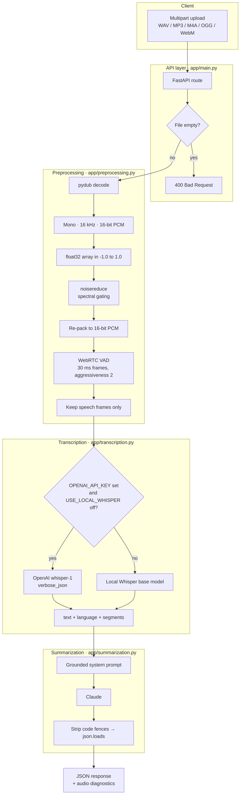

# Voice Insight API

A FastAPI service that turns noisy, real-world audio into a clean transcript and a structured summary with key points, action items and topics.

**Demo:** [2-minute walkthrough](LOOM_LINK_HERE)

> **In one line:** upload a meeting recording, voice note or lecture clip → the API removes background noise and silence, transcribes the speech with Whisper, and has Claude return a JSON summary grounded only in what was said.

---

## Table of contents

1. [Why this exists](#why-this-exists)
2. [Features](#features)
3. [Architecture](#architecture)
4. [How the pipeline works](#how-the-pipeline-works)
5. [Project structure](#project-structure)
6. [Tech stack](#tech-stack)
7. [Getting started](#getting-started)
8. [Configuration](#configuration)
9. [API reference](#api-reference)
10. [Error handling](#error-handling)
11. [Testing](#testing)
12. [Design decisions](#design-decisions)
13. [Signal-processing notes](#signal-processing-notes)
14. [Known limitations](#known-limitations)
15. [Roadmap](#roadmap)

---

## Why this exists

Most transcription demos assume studio-quality audio. Real recordings have fan hum, keyboard noise, long pauses and people thinking out loud. Sending that straight to a speech model wastes money on silence and gives worse transcripts, and sending a raw transcript to an LLM often produces summaries that invent details.

Voice Insight API handles both problems in one pipeline:

- **Clean first.** Noise reduction and voice activity detection run *before* transcription, so the speech model only sees speech.
- **Summarize safely.** The LLM is restricted to the transcript and must return a fixed JSON shape that other code can rely on.
- **Fail loudly.** When a dependency is missing or an upstream API fails, the service returns a clear error instead of fake output.

---

## Features

- Accepts **WAV, MP3, M4A, OGG, WebM** and any other format FFmpeg can decode (FFmpeg is bundled via `static-ffmpeg`, so there's no system install).
- Normalizes all audio to **mono, 16 kHz, 16-bit PCM**, the format speech models expect.
- **Spectral-gating noise reduction** (`noisereduce`, non-stationary mode) for fan hum, room tone and line noise.
- **WebRTC voice activity detection** on 30 ms frames to strip silence and non-speech.
- **Two transcription engines:** the OpenAI `whisper-1` API, or a local Whisper `base` model when no API key is set.
- **Timestamped segments** (`start`, `end`, `text`) and detected language in every transcript.
- **Claude summarization** into `summary`, `key_points`, `action_items` and `topics`.
- **Audio diagnostics** in every response: original duration, speech duration and silence removed.
- Two endpoints for two needs: `/transcribe` (speech only) and `/process` (full pipeline).
- Interactive **Swagger UI** at `/docs`, generated automatically by FastAPI.
- **Explicit error mapping** (`400` / `422` / `502`) so clients know what failed and why.
- An **end-to-end test script** that synthesizes real noisy speech and exercises every stage and endpoint.

---

## Architecture



Each stage is a separate module with one public function (`preprocess`, `transcribe`, `summarize`), so each one can be tested, swapped or reused on its own.

---

## How the pipeline works

### 1. Preprocessing (`app/preprocessing.py`)

| Step | Function | What happens |
| --- | --- | --- |
| Load | `load_audio` | `pydub.AudioSegment.from_file` decodes any container FFmpeg understands, straight from memory. |
| Normalize | `to_mono_16k` | Downmix to 1 channel, resample to 16,000 Hz, convert to 16-bit samples. |
| To array | `audiosegment_to_np` | Convert samples to `float32` and scale into `[-1.0, 1.0]` by dividing by 32,767. |
| Denoise | `denoise` | `noisereduce.reduce_noise(..., stationary=False)` estimates a noise profile across frequencies and attenuates bins below it. |
| Detect speech | `voice_activity_segments` | Re-pack to 16-bit PCM bytes, split into 30 ms frames (480 samples = 960 bytes), and ask WebRTC VAD whether each frame is speech. |
| Strip silence | `strip_silence` | Concatenate only the speech frames. If *no* frame is speech, return the audio unchanged rather than an empty array. |
| Report | `preprocess` | Return the cleaned samples plus `original_duration_s`, `processed_duration_s` and `silence_removed_s`. |

### 2. Transcription (`app/transcription.py`)

- **API mode** (when `OPENAI_API_KEY` is set and `USE_LOCAL_WHISPER` is not): the cleaned samples are written back to an in-memory WAV and sent to `whisper-1` with `response_format="verbose_json"`, which returns text, language and timestamped segments.
- **Local mode** (no key, or `USE_LOCAL_WHISPER=true`): the open-source `whisper` package loads the `base` model once, caches it for later requests, and transcribes the float array directly.
- Either way, the result has the same shape: `text`, `language`, `segments[]` and `mode` (`openai_api` or `local_whisper`).
- If local Whisper isn't installed and there's no key, a `RuntimeError` explains exactly what to install or set.

### 3. Summarization (`app/summarization.py`)

The transcript is sent to Claude with this system prompt (abridged):

```text
You are a precise meeting/audio summarizer. You will be given a raw
speech-to-text transcript, which may contain minor transcription errors,
filler words, or disfluencies. Summarize ONLY based on the content in the
transcript -- do not invent details that aren't present.

Respond with ONLY valid JSON, no markdown fences, no preamble, in this exact shape:
{
  "summary": "2-4 sentence high-level summary",
  "key_points": ["point 1", "point 2", "..."],
  "action_items": ["action 1", "..."],
  "topics": ["topic1", "topic2"]
}
If there are no clear action items, return an empty list for that field.
```

The reply is cleaned (any ```` ```json ```` fences removed) and parsed. If it still isn't valid JSON, the raw text is returned in `summary` with a `_parse_warning` field, so nothing is silently lost. An empty transcript short-circuits to an empty summary without calling the API.

---

## Project structure

```text
voice-insight-api/
├── app/
│   ├── __init__.py
│   ├── main.py            # FastAPI app, routes, validation, error mapping
│   ├── preprocessing.py   # decode → normalize → denoise → VAD → diagnostics
│   ├── transcription.py   # OpenAI Whisper API or local Whisper
│   └── summarization.py   # Claude prompt, JSON parsing, fallbacks
├── test_audio/            # generated test audio (WAVs are git-ignored)
├── test_pipeline.py       # end-to-end verification script
├── requirements.txt
└── README.md
```

---

## Tech stack

| Concern | Choice | Why |
| --- | --- | --- |
| Web framework | **FastAPI** + Uvicorn | Async request handling, automatic validation and free Swagger docs. |
| Audio I/O | **pydub** + **static-ffmpeg** | Decodes almost any format; bundled FFmpeg means no system dependency on dev machines. |
| Python 3.13 support | **audioop-lts** | Restores the `audioop` module that pydub needs and that Python 3.13 removed. |
| Noise reduction | **noisereduce** | Fast spectral gating that works on both steady and changing background noise. |
| Voice activity detection | **webrtcvad-wheels** | The battle-tested WebRTC VAD engine, with prebuilt wheels for easy installs. |
| Speech recognition | **OpenAI Whisper** (API or local) | Robust to accents and background noise; the local option works offline. |
| Summarization | **Anthropic Claude** | Strong instruction-following for strict JSON output and grounded summaries. |
| Testing | **gTTS** + FastAPI **TestClient** | Real synthesized speech as test input; endpoints tested in-process without a running server. |

---

## Getting started

### Prerequisites

- Python **3.10–3.13**
- An **Anthropic API key** for summarization (`/process`)
- *Optional:* an **OpenAI API key** for hosted Whisper. Without one, local Whisper is used, which downloads the `base` model (~140 MB) on first run.

### Install

```bash
git clone https://github.com/Riddhim-r/voice-insight-api.git
cd voice-insight-api

python -m venv venv
source venv/bin/activate          # Windows: venv\Scripts\activate

pip install -r requirements.txt
```

### Set keys

```bash
# macOS / Linux
export ANTHROPIC_API_KEY="sk-ant-..."
export OPENAI_API_KEY="sk-..."          # optional

# Windows PowerShell
$env:ANTHROPIC_API_KEY="sk-ant-..."
$env:OPENAI_API_KEY="sk-..."            # optional
```

### Run

```bash
uvicorn app.main:app --reload --port 8000
```

- API: `http://localhost:8000`
- Interactive docs: `http://localhost:8000/docs`

---

## Configuration

| Variable | Required | Default | Effect |
| --- | --- | --- | --- |
| `ANTHROPIC_API_KEY` | For `/process` | — | Enables Claude summarization. Missing → `/process` returns `502` with an explanation. |
| `OPENAI_API_KEY` | No | — | Uses the hosted `whisper-1` API for transcription. |
| `USE_LOCAL_WHISPER` | No | `false` | Set to `true` or `1` to force local Whisper even when an OpenAI key exists. |

Tunable constants in code:

| Constant | Location | Default | Meaning |
| --- | --- | --- | --- |
| `TARGET_SR` | `preprocessing.py` | `16000` | Sample rate everything is converted to. |
| `frame_ms` | `voice_activity_segments` | `30` | VAD frame length (WebRTC accepts 10, 20 or 30 ms). |
| `aggressiveness` | `voice_activity_segments` | `2` | VAD strictness from 0 (keeps most) to 3 (cuts most). |
| Whisper model | `_get_local_model` | `base` | Local model size (`tiny`, `small`, `medium`… trade speed for accuracy). |
| Claude model | `summarization.py` | set in code | Model used for summaries; `max_tokens=1000`. |

---

## API reference

### `GET /health`

Liveness check.

```json
{ "status": "ok", "service": "Voice Insight API" }
```

### `POST /transcribe`

Preprocessing and transcription only. Useful for debugging the speech stage on its own.

**Request:** `multipart/form-data` with a `file` field.

```bash
curl -X POST http://localhost:8000/transcribe -F "file=@sample.wav"
```

**Response `200`:**

```json
{
  "transcript": "Welcome to the Voice Insight API demonstration. ...",
  "language": "en",
  "segments": [
    { "start": 0.0, "end": 3.04, "text": "Welcome to the Voice Insight API demonstration." },
    { "start": 3.04, "end": 8.48, "text": "We are testing speech recognition ..." }
  ],
  "transcription_mode": "local_whisper",
  "audio_diagnostics": {
    "original_duration_s": 14.76,
    "processed_duration_s": 11.31,
    "silence_removed_s": 3.45
  }
}
```

### `POST /process`

The full pipeline: preprocessing → transcription → summarization.

```bash
curl -X POST http://localhost:8000/process -F "file=@meeting.m4a"
```

**Response `200`:**

```json
{
  "transcript": "...",
  "language": "en",
  "summary": "2–4 sentence overview of the recording.",
  "key_points": ["...", "..."],
  "action_items": ["..."],
  "topics": ["...", "..."],
  "audio_diagnostics": {
    "original_duration_s": 14.76,
    "processed_duration_s": 11.31,
    "silence_removed_s": 3.45
  }
}
```

---

## Error handling

| Situation | Status | Example `detail` |
| --- | --- | --- |
| Empty upload | `400` | `Uploaded file is empty.` |
| File can't be decoded or processed | `422` | `Preprocessing failed: ...` |
| No transcription engine available, or Whisper API error | `502` | `Transcription failed: Local Whisper transcription failed ... provide a valid OPENAI_API_KEY.` |
| `ANTHROPIC_API_KEY` missing, or Claude API error | `502` | `Summarization failed: ANTHROPIC_API_KEY environment variable is not set. ...` |

`502 Bad Gateway` is used for upstream failures on purpose: the request was fine, but a service this API depends on wasn't available.

---

## Testing

```bash
python test_pipeline.py
```

The script:

1. **Generates real speech** with gTTS, pads it with 1.5 s of silence at each end, and mixes in Gaussian background noise (σ = 0.03) to imitate room hum.
2. **Tests preprocessing:** checks durations, sample rate and how much silence VAD removed.
3. **Tests transcription:** runs Whisper if available; otherwise confirms it fails with a clear error instead of fake text.
4. **Tests summarization:** runs Claude if a key is set; otherwise confirms the explicit failure.
5. **Tests every endpoint** in-process with FastAPI's `TestClient`.

### Sample run (local Whisper, no Anthropic key)

```text
--- Step 1: Preprocessing Unit Test (Real Audio) ---
Original Audio Duration : 14.76 s
Processed Audio Duration: 11.31 s
Silence Removed Duration: 3.45 s

--- Step 2: Transcription Verification ---
Transcription Mode: local_whisper
Detected Language : en

--- Step 3: Summarization Verification ---
[EXPLICIT SAFETY CHECK PASSED] Summarizer failed hard as expected when key is unconfigured

--- Step 4: FastAPI Endpoint Tests ---
GET /health status: 200
POST /transcribe status: 200
POST /process status: 502   ← expected: no Anthropic key configured
```

On this sample, VAD removed **3.45 s of a 14.76 s clip (about 23%)** before transcription.

---

## Design decisions

**1. Clean the audio before Whisper, not after.**
Noise reduction and VAD run first, so the speech model only receives speech. That lowers API cost and latency (the Whisper API is billed by audio length) and reduces the text Whisper is known to hallucinate during long silences.

**2. Fail hard instead of faking output.**
There are no placeholder transcripts or canned summaries anywhere in the code. A missing key or a failed upstream call becomes an explicit error with an actionable message. For a system whose output people act on, a visible failure is far safer than a plausible-looking fake.

**3. Map errors to the right status codes.**
`400` means the client sent nothing, `422` means the audio couldn't be processed, and `502` means an upstream AI service failed. Clients can tell "fix your request" apart from "try again later" without parsing messages.

**4. Force structured output, but never drop data.**
The model must return one fixed JSON shape so the response can be consumed by other code. If it doesn't comply, the raw text is still returned with a `_parse_warning`, so the caller loses nothing and can see what went wrong.

**5. One interface, two transcription engines.**
Hosted Whisper is fast and needs no GPU; local Whisper works offline and costs nothing. Both return the same structure, so the rest of the pipeline doesn't care which one ran.

**6. Return diagnostics with every response.**
Original duration, speech duration and silence removed make the preprocessing visible and easy to tune, which helps with debugging and with explaining cost savings.

---

## Signal-processing notes

**Why 16 kHz?** By the Nyquist theorem, a 16 kHz sample rate captures frequencies up to 8 kHz, which covers the parts of human speech that matter for intelligibility. It's also the rate Whisper's feature extractor expects, and it keeps arrays small.

**How spectral gating works.** The signal is split into short overlapping windows (a short-time Fourier transform). For each frequency band, the algorithm estimates a noise floor and builds a mask that keeps bins clearly above it and attenuates the rest. The cleaned signal is then rebuilt from the masked spectrum. Non-stationary mode re-estimates the noise over time, which handles noise that changes during a recording.

**Why the VAD frame size is exact.** WebRTC VAD only accepts 10, 20 or 30 ms frames of 16-bit PCM. At 16 kHz, 30 ms is 480 samples, or exactly 960 bytes. `np_to_pcm16_bytes` clips the float signal to `[-1, 1]` before converting so loud peaks can't wrap around into noise.

---

## Known limitations

- The whole upload is read into memory, so very large files (>50 MB) should be streamed to disk instead.
- Preprocessing and transcription are CPU-bound and currently run inside async route handlers, so long files block other requests on the same worker. Running them in a thread pool or a task queue would fix this.
- `ALLOWED_CONTENT_TYPES` is defined in `main.py` but not yet enforced; validation currently relies on decoding.
- Frames left over at the end of the audio (shorter than 30 ms) are dropped by VAD.

---

## Roadmap

- [ ] Move CPU-heavy work off the event loop (`run_in_threadpool` or Celery + Redis).
- [ ] Stream large uploads to disk in chunks.
- [ ] Speaker diarization ("who said what").
- [ ] Make the Claude model and VAD aggressiveness configurable via environment variables.
- [ ] Dockerfile with a pre-cached Whisper model.
- [ ] Convert `test_pipeline.py` into a pytest suite and run it in CI.

---

## Author

**Riddhim Rathor** · [LinkedIn](https://linkedin.com/in/riddhim-rathor) · [Portfolio](https://riddhim-spotted-on.vercel.app/) · [GitHub](https://github.com/Riddhim-r)
