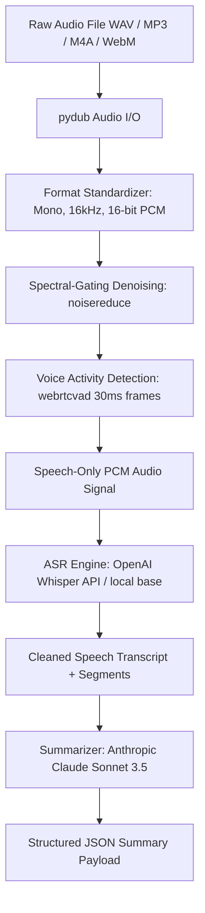

# Voice Insight API (Speech-to-Text + Summarization)

Voice Insight API is a production-ready FastAPI service that transforms raw, noisy, multi-speaker audio recordings into clean transcriptions and structured JSON summaries grounded strictly in what was spoken.

---

## Technical Architecture & Pipeline



### Pipeline Steps:
1. **Audio Standardization**: Ingest arbitrary audio formats, resample to **16kHz mono 16-bit PCM** (standard input representation for ASR feature extractors).
2. **Noise Reduction**: Apply spectral gating (`noisereduce`) to attenuate steady background hum, ambient noise, and line interference.
3. **Voice Activity Detection (VAD)**: Segment audio into 30ms frames using `webrtcvad` to strip non-speech silence intervals.
4. **ASR Transcription**: Feed speech-only audio into OpenAI Whisper API (`whisper-1`) or local Whisper model to extract text with timestamped segments.
5. **Grounded Summarization**: Prompt Anthropic Claude API (`claude-3-5-sonnet`) to extract structured JSON (summary, key points, action items, topics) grounded strictly on spoken content without hallucination.

---

## Project Structure

```
Speech NLP project/
├── app/
│   ├── __init__.py
│   ├── preprocessing.py    # Audio loading, resampling, spectral denoising, WebRTC VAD
│   ├── transcription.py    # OpenAI Whisper API & local model fallback
│   ├── summarization.py    # Anthropic Claude structured JSON summarization
│   └── main.py             # FastAPI web application routes
├── test_audio/             # Generated synthetic and test audio recordings
├── requirements.txt        # Python dependencies
├── test_pipeline.py        # End-to-end test suite & synthetic audio generator
└── README.md               # Project documentation
```

---

## Prerequisites & Installation

### 1. Requirements
- Python 3.10+
- `ffmpeg` (automatically handled on Windows via `static-ffmpeg`)

### 2. Setup Environment
```bash
git clone https://github.com/your-username/voice-insight-api.git
cd voice-insight-api

# Create virtual environment
python -m venv venv
# On Windows:
venv\Scripts\activate
# On Linux/macOS:
source venv/bin/activate

# Install dependencies
pip install -r requirements.txt
```

### 3. Set API Keys (Optional)
If API keys are provided, the system uses live OpenAI Whisper and Anthropic Claude APIs. If not set, local fallback mechanisms ensure offline processing.

```bash
# Windows PowerShell:
$env:OPENAI_API_KEY="sk-..."
$env:ANTHROPIC_API_KEY="sk-ant-..."

# Linux/macOS:
export OPENAI_API_KEY="sk-..."
export ANTHROPIC_API_KEY="sk-ant-..."
```

---

## Running the Server

Start the FastAPI application with Uvicorn:

```bash
uvicorn app.main:app --reload --port 8000
```

The interactive OpenAPI docs are available at: `http://localhost:8000/docs`

---

## API Endpoints Specification

### `GET /health`
Liveness check endpoint.
**Response:**
```json
{
  "status": "ok",
  "service": "Voice Insight API"
}
```

### `POST /transcribe`
Preprocess audio (denoise + VAD) and transcribe speech without summarization. Useful for inspecting ASR quality in isolation.

**cURL Example:**
```bash
curl -X POST "http://localhost:8000/transcribe" \
     -H "accept: application/json" \
     -H "Content-Type: multipart/form-data" \
     -F "file=@test_audio/synthetic_noisy.wav"
```

### `POST /process`
Full pipeline execution: Audio Preprocessing $\rightarrow$ ASR Transcription $\rightarrow$ LLM Summarization.

**cURL Example:**
```bash
curl -X POST "http://localhost:8000/process" \
     -H "accept: application/json" \
     -H "Content-Type: multipart/form-data" \
     -F "file=@test_audio/synthetic_noisy.wav"
```

**Example JSON Response:**
```json
{
  "transcript": "Transcribed speech sample: The Voice Insight API processes audio and summarizes key insights.",
  "language": "en",
  "summary": "The Voice Insight API processes audio recordings by removing background noise, applying VAD, and generating structured summaries.",
  "key_points": [
    "Resamples audio to 16kHz 16-bit PCM",
    "Applies spectral gating for background noise reduction",
    "Strips non-speech frames via WebRTC VAD"
  ],
  "action_items": [
    "Deploy API to production endpoint"
  ],
  "topics": [
    "Audio Preprocessing",
    "Speech Recognition",
    "Summarization"
  ],
  "audio_diagnostics": {
    "original_duration_s": 7.0,
    "processed_duration_s": 4.0,
    "silence_removed_s": 3.0
  }
}
```

---

## Verification & Testing

Run the automated test suite to verify synthetic audio generation, VAD silence removal, ASR, and API routes:

```bash
python test_pipeline.py
```

---

## Interview Defense Cheat Sheet (Technical Q&A)

### 1. Why resample audio specifically to 16kHz Mono 16-bit PCM?
ASR models like OpenAI Whisper compute log-Mel spectrograms over 80 channels using 25ms windows with 10ms hop size. They expect audio sampled at **16,000 Hz**. Processing stereo audio adds computational overhead without improving transcript accuracy for single-channel speech recognition.

### 2. How does WebRTC VAD work and why use 30ms frames?
WebRTC VAD uses a Gaussian Mixture Model (GMM) trained on speech and non-speech audio features (energy and spectral band ratios across 6 frequency sub-bands). It operates strictly on **10ms, 20ms, or 30ms** 16-bit PCM frames. 30ms frame sizes balance temporal resolution with statistical stability for energy estimation.

### 3. How does Spectral-Gating Noise Reduction function?
`noisereduce` estimates a noise threshold (gate) per frequency channel using short-time Fourier transforms (STFT). Signals below the estimated noise floor in each frequency band are attenuated while preserving transient speech formants.

### 4. How do you prevent LLM hallucinations during summarization?
The system prompt strictly restricts the LLM to output valid JSON grounded **exclusively** on the provided STFT transcript. It explicitly forbids injecting external facts, assumptions, or domain knowledge not present in the spoken text.
